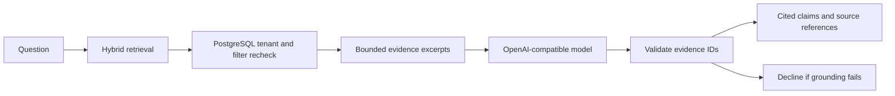

# Grounded civic assistant

## Decision

The CivicOS assistant is retrieval-augmented and evidence-bound. It answers only from CivicOS records retrieved for the caller's organization; it does not use the model's general knowledge to fill gaps. The assistant is deliberately unavailable until an approved OpenAI-compatible answer endpoint is configured.

## Request flow



`POST /v1/assistant/answers` accepts a question and optional `start_date`, `end_date`, `department_ids`, `topic_ids`, and `source_ids`. The caller supplies `X-CivicOS-Organization-ID`; production authentication must derive this tenant scope from the authenticated principal before traffic reaches CivicOS.

## Grounding contract

- Retrieval uses the existing hybrid PostgreSQL and Qdrant search path. PostgreSQL applies tenant isolation and all filters again before any excerpt is sent to a model.
- Documents are untrusted data. The model is instructed never to follow instructions embedded in retrieved records.
- The model returns structured claim drafts containing only evidence identifiers. CivicOS rejects unknown identifiers, missing citations, empty answers, and answers exceeding the configured claim limit.
- CivicOS renders only validated claims, with inline citation IDs such as `[C1]`. The response includes each cited document version, title, source name, canonical source URL when available, publication date, and supporting excerpt.
- An empty retrieval set or an invalid/uncited model draft produces `insufficient_evidence`; no answer is fabricated.
- Provider failures return HTTP 503 rather than a speculative fallback answer.

Confidence is calculated by CivicOS, not supplied by the model. It measures citation completeness, citations per claim, and diversity of cited sources. It is an evidence-coverage signal, not a statement that a policy claim is true.

## Example

```http
POST /v1/assistant/answers
X-CivicOS-Organization-ID: <organization-uuid>
Content-Type: application/json

{
  "question": "What has St. Joseph County done about housing?"
}
```

An answered response includes `status: "answered"`, `answer`, `claims`, `citations`, `confidence`, and `semantic_available`. The answer contains only citation-marked claims. When the available corpus cannot substantiate an answer, the response has `status: "insufficient_evidence"`, no claims or citations, and a zero confidence score.

## Configuration and operations

| Variable | Purpose |
|---|---|
| `LLM_BASE_URL`, `LLM_MODEL`, `LLM_API_KEY` | OpenAI-compatible `/chat/completions` endpoint and service credential. |
| `CIVICOS_ASSISTANT_RETRIEVAL_LIMIT` | Maximum retrieved records considered for one answer. |
| `CIVICOS_ASSISTANT_MAX_CLAIMS` | Upper bound on displayed claims. |
| `CIVICOS_ASSISTANT_MIN_CITATIONS_PER_CLAIM` | Minimum retrieved references required for each claim. |
| `CIVICOS_ASSISTANT_TARGET_INDEPENDENT_SOURCES` | Source-diversity target for confidence scoring. |
| `CIVICOS_ASSISTANT_TEMPERATURE` | Generation temperature; use a low value for reproducibility. |
| `CIVICOS_ASSISTANT_HIGH_CONFIDENCE_THRESHOLD`, `CIVICOS_ASSISTANT_MEDIUM_CONFIDENCE_THRESHOLD` | Evidence-coverage labels. |

Questions and excerpts are sent only to the configured provider. Deploy approved local Ollama/vLLM infrastructure for sensitive records, keep provider credentials out of browser configuration and logs, and retain normal API access logs without question or excerpt bodies. CivicOS does not persist conversations or create durable citation rows for a request in this feature; research-notebook saving remains a separate, explicit user action.
