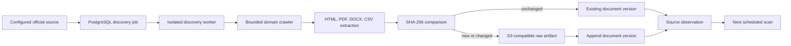

# Autonomous data discovery

## Decision

CivicOS discovers public civic records through a separate ingestion worker, rather than an API upload workflow. A `civic.sources` record is the sole entry point: it names an official website, its organization, scan limits, and an `acquisition_policy` JSON object. Creating or reactivating an active source automatically places it on the durable PostgreSQL queue.

This is an intentionally bounded crawler, not a general web search system. The St. Joseph County rollout should configure one source record per official county, municipal, or department site, beginning with the official domains approved by the deployment operator.

## Flow

## Source policy

`acquisition_policy` is validated by the worker. It may contain:

| Key | Type | Default | Purpose |
|---|---|---:|---|
| `allowed_domains` | string array | canonical source host only | Additional official subdomains or hosts the crawler may visit. |
| `allowed_path_prefixes` | string array | `['/']` | Absolute-path prefixes the crawler may fetch. Use this to keep a connector within its official records section. |
| `respect_robots` | boolean | `true` | Fetch and obey `robots.txt`; an unreachable robots file fails closed for that origin. |
| `max_content_bytes` | integer | 25 MB | Per-response upper limit; it may only lower the deployment hard limit. |

The database additionally stores `scan_interval_seconds` (default six hours), `max_pages_per_scan` (default 100), and `request_timeout_seconds` (default 20 seconds). These are per-source configuration, never application constants. URLs with credentials, non-HTTP(S) schemes, off-domain redirects, and resources beyond the configured byte limit are rejected.

## Change and provenance model

Each successful fetch creates a `civic.source_observations` record containing the original requested URL, final redirect URL, status, media type, ETag, Last-Modified value, and SHA-256 hash. This preserves evidence even when the fetched document has not changed.

The worker resolves the logical `civic.documents` record by its final canonical URL. It appends an immutable `civic.document_versions` row only if the fetched body hash differs from the latest version. Raw bytes are retained under a content-addressed S3 key and linked through `civic.document_artifacts`. Content-addressing makes retry-created storage objects harmless; object lifecycle rules may clean up unreferenced artifacts after transaction failures.

## Scheduling and failure handling

`civic.discovery_jobs` is a PostgreSQL-backed queue. Workers lease jobs using `FOR UPDATE SKIP LOCKED`, so several replicas can run safely. A lease expires after ten minutes, allowing recovery after a worker crash. Successful scans run again after the source interval; failures are recorded on both the job and scan run and retried with capped exponential backoff.

Queue claiming is the only cross-tenant operation. `civic.claim_discovery_jobs(integer)` is `SECURITY DEFINER`, its public grant is revoked, and the ingestion role must receive an explicit `EXECUTE` grant. Every subsequent worker transaction calls `set_config('app.organization_id', ..., true)`, remains covered by RLS, and must not have `BYPASSRLS`.

## Deployment requirements

- Run the `discovery` Docker Compose profile only after applying migration `0002`.
- Provide S3-compatible credentials restricted to `PutObject` within the configured artifact bucket; use a separate provisioner to create the bucket and lifecycle policy.
- Provision a database role for the worker with its normal tenant-table permissions plus only `GRANT EXECUTE ON FUNCTION civic.claim_discovery_jobs(integer)` for cross-tenant work.
- Monitor failed scan runs, overdue jobs, object-store errors, and unexpected page/document counts. Alerting and source approval remain an operator responsibility; the scan lifecycle itself requires no founder intervention.

There is deliberately no manual upload route or public arbitrary-URL crawl endpoint.
