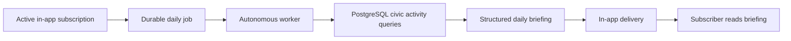

# Daily briefings

## Purpose

Daily Briefing is an autonomous, source-linked digest of civic activity for an organization. It surfaces newly observed documents, near-term meetings, recently updated ordinances and budgets, topic activity, and later upcoming events without inventing a narrative or policy conclusion.

## Generation flow

The ingestion worker evaluates the configured IANA timezone and enqueues at most one job per organization and local briefing date. Job leasing and retries follow the same durable pattern as discovery and vector-index work. A failed generation is retried with capped exponential backoff.

`CIVICOS_BRIEFING_NEAR_TERM_DAYS`, `CIVICOS_BRIEFING_LOOKAHEAD_DAYS`, and `CIVICOS_BRIEFING_SECTION_LIMIT` control the meeting windows and bounded section size. `CIVICOS_BRIEFING_TIMEZONE` is intentionally configurable; no municipality timezone is embedded in application code.

## Sections and grounding

| Section | Source-of-truth query |
|---|---|
| New documents | Logical documents first observed on the briefing date. |
| Important meetings | Meetings scheduled from the briefing date through the near-term window. |
| Policy changes | Ordinances updated on the briefing date, including their current status. |
| Budget changes | Budgets or budget lines updated on the briefing date. |
| Trending topics | Topic assignments created on the briefing date, ranked by count. |
| Upcoming events | Meetings after the near-term window and before the lookahead horizon. |

Each item includes the normalized record identifier and, where the source model has one, an original URL. The worker does not use an LLM for daily briefing content. This keeps the digest auditable and prevents unsupported policy summaries.

## Subscription and delivery API

All endpoints require `X-CivicOS-Organization-ID` and `X-CivicOS-User-ID`. The API verifies an active membership and must eventually receive these scopes from authenticated identity, not browser-provided headers.

| Route | Purpose |
|---|---|
| `POST /v1/briefing-subscriptions` | Create or reactivate the caller’s in-app subscription. |
| `DELETE /v1/briefing-subscriptions/{id}` | Deactivate a subscription. |
| `GET /v1/briefings` | List briefing deliveries available to the caller. |
| `POST /v1/briefings/{id}/read` | Mark one delivered briefing as read. |

The first implementation supports the `in_app` channel only. Email, push, and webhook delivery require an approved provider, delivery security policy, consent/retention rules, and a separate feature decision; they are not silently simulated as successful deliveries.

## Stored records

Migration `0006_daily_briefings.up.sql` adds `research.briefing_subscriptions`, `civic.daily_briefing_jobs`, `research.daily_briefings`, and `research.daily_briefing_deliveries`. The briefing payload is a rebuildable JSON projection of underlying civic data; delivery rows retain each subscriber’s availability and read state.
