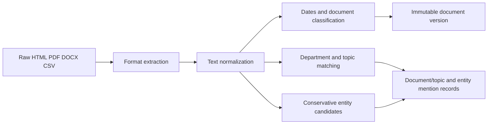

# Document processing pipeline

## Decision

Every newly observed document version is processed synchronously by the isolated ingestion worker before its immutable version row is committed. The first implementation uses deterministic, inspectable rules and existing tenant vocabulary; it does not send civic documents to a hosted model provider.

This keeps the processing path operational without human intervention while preserving a clear upgrade path to an approved local or OpenAI-compatible model adapter. Any semantic-model introduction requires a separate ADR covering evaluation, model provenance, retention, and egress.

## Pipeline

## Processing behavior

- **Text extraction:** HTML, PDF, DOCX, and CSV content is converted to text by the ingestion extractor.
- **Cleaning:** Unicode is normalized, control characters are removed, whitespace is made consistent, and meaningful line boundaries are retained.
- **Metadata:** `extracted_metadata` records the processor version, source format, source extraction metadata, character and word counts, matched department/topic names, and date candidates with source offsets.
- **Document classification:** generic civic-document rules classify agendas, minutes, ordinances, resolutions, budgets, notices, and reports. If no rule wins, the format classification is retained. Rules are generic, not county-specific.
- **Dates:** ISO, US numeric, and long-form English dates are retained as candidates. Only an explicitly labelled Published, Posted, Issued, or Date value populates `documents.published_at`; other dates remain evidence, not assumptions.
- **Departments and topics:** active organization-scoped department and topic names are matched as whole phrases. A document receives at most the longest department match and any matching tenant topics.
- **Entities:** the initial pass extracts conservative person and organization candidates with exact source offsets. It does not claim identity resolution; a mention always retains its observed text and links to a tenant-scoped entity candidate.

## Database mapping

| Processing output | Storage |
|---|---|
| Cleaned text and structured metadata | `civic.document_versions.extracted_text`, `extracted_metadata` |
| Civic document classification and explicit publication date | `civic.documents.document_type`, `published_at` |
| Department match | `civic.documents.department_id` |
| Topic matches | `civic.topic_assignments` targeting the logical document |
| Entity candidates and offsets | `civic.entities`, `civic.document_entity_mentions` targeting the immutable version |
| Exact references to civic graph nodes | `civic.knowledge_graph_edges`; location references also create `civic.document_location_mentions` |

Processing is performed only when the raw content hash produces a new document version. The document-level advisory lock already used during version creation also prevents duplicate topic assignments within concurrent scans.

The same processing pass discovers exact references to tenant meetings, ordinances, budgets, projects, officials, and locations. See `knowledge-graph.md` for the graph model and relationship evidence contract.

## Limits and review

This is a baseline enrichment layer, not a substitute for human verification. Date candidates are capped at 25 and entity candidates at 100 per version to bound processing. The processor metadata records `deterministic-v1`; changing its behavior requires a version increment and an explicit reprocessing strategy rather than overwriting historical evidence.
