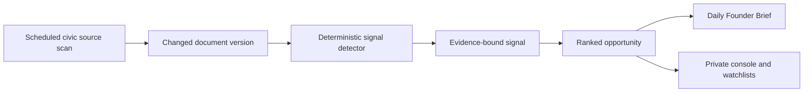

# Founder Intelligence Console

## Purpose and boundary

Founder Intelligence is a private, tenant-administrator-only workspace for finding commercially relevant changes in automatically ingested civic records. It is not a public-beta feature, is omitted from the public navigation, and is not a government-administration console.

The console answers a founder’s morning questions in this order:

1. What changed?
2. Why could it matter commercially?
3. Where might spending or demand emerge?
4. Who might pay for this intelligence or the resulting work?
5. What should be verified next?

It does not assert that a contract will be awarded, that a business will buy, or that a market value exists. Those are founder decisions requiring review of the cited record.

## Automated flow

The existing discovery worker runs continuously. It detects new or changed HTML, PDF, DOCX, and CSV content; when a new document version is persisted, it evaluates the version against a typed, deterministic rule set. Signals are idempotent per organization, document version, and signal type. There is no upload path and no manual collection step.

Every signal retains the document ID, immutable document-version ID, original source URL, excerpt, and excerpt offsets. A document update produces a new version and can therefore produce a newly evaluated signal without erasing prior evidence.

## Signals

The initial taxonomy detects evidence for:

- Procurement, RFP, RFQ, bid, and solicitation language
- Development and redevelopment activity
- Zoning and land-use changes
- Public spending and scope changes
- Grants and funding
- Infrastructure projects
- Regulations that may affect businesses
- Unusual-change indicators, such as emergency, sole-source, waiver, or amendment language

“Unusual-change indicator” is intentionally conservative: it flags a record for review and is not an allegation of wrongdoing or a statistical anomaly claim.

## Opportunity scoring

Each opportunity has a transparent score from 0 to 100:

| Input | Weight | Meaning |
|---|---:|---|
| Estimated economic value | 30% | Relative likelihood that an initiative could create material spend or demand. |
| Confidence | 20% | Strength of the deterministic rule match. |
| Recency | 15% | Newly observed document versions receive the highest value. |
| Urgency | 15% | Relative time sensitivity implied by the signal type. |
| Strength of evidence | 10% | Number and specificity of source-language matches. |
| Commercial actionability | 10% | Whether the record suggests a concrete next verification step. |

The formula and rule profiles are versioned application policy, not hidden model reasoning. The briefing threshold and section size are deployment configuration: `CIVICOS_FOUNDER_BRIEF_MINIMUM_SCORE` and `CIVICOS_FOUNDER_BRIEF_SECTION_LIMIT`.

The resulting opportunity displays `what happened`, `why it matters`, `where the money may be`, `who might pay`, `action to take`, urgency, score, and evidence. Buyer segments are generalized prospect categories, never an unsupported assertion about an identifiable company.

## Watchlists and API

Tenant administrators can create private watchlists for companies, industries, properties, geographic areas, government departments, projects, and topics. Each newly persisted signal is matched continuously against active watchlist terms; the watchlist API returns its match count and latest match time. Notifications are a follow-on delivery feature, but monitoring, match persistence, source ingestion, and signal generation already operate without a founder task.

All routes are under the authenticated `/v1/founder` namespace and require an active `tenant_admin` membership:

| Route | Purpose |
|---|---|
| `GET /v1/founder/opportunities` | Ranked, open founder opportunities with citations. |
| `GET /v1/founder/signals` | Detected signals and their evidence. |
| `GET` / `POST /v1/founder/watchlists` | Read or create private monitoring targets. |
| `GET /v1/founder/brief` | Latest high-value daily Founder Brief. |

The API derives organization and user scope from the existing OIDC edge middleware. Database security-definer functions independently verify tenant-admin membership and row-level security isolates all founder tables by organization.

## Daily Founder Brief

The worker durable-enqueues one brief job per active organization and local briefing date, claims jobs with a lease, and retries failures with capped exponential backoff. The brief contains only newly discovered, active opportunities at or above the configured score threshold. It is extractive and structured—no LLM is used to embellish commercial claims.

The private `/founder` page is a visual shell illustrating the morning workflow. It intentionally has no link from the public beta and should be connected to the protected API only after the frontend OIDC session integration is in place.

## Operations

Apply migration `0009_founder_intelligence.up.sql` after migration `0008`. The same deployment must run the existing ingestion worker; no additional cron job or human daily task is required. Monitor the worker’s established failure logs plus failed `founder.daily_brief_jobs` and the freshness of `founder.daily_briefs`.
