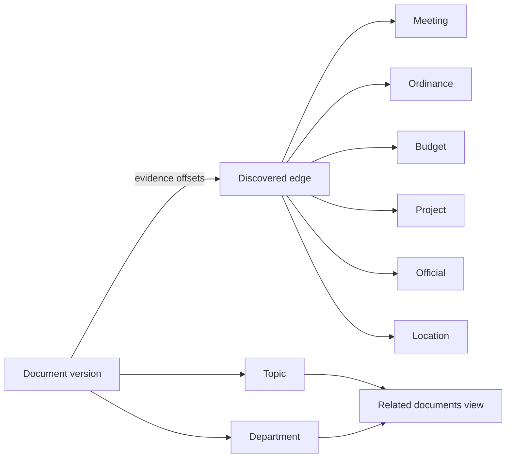

# CivicOS knowledge graph

## Decision

CivicOS implements its knowledge graph as a PostgreSQL projection, not a second graph database. PostgreSQL remains the authority for tenant isolation, lifecycle, and evidence. This avoids dual-write consistency work while retaining graph traversal through relational views.

The graph is deliberately evidence-backed. An automated edge identifies the document version, text offsets, matched text, discovery method, and confidence that produced it. Structural relationships already present in civic tables are projected into the same read view with `structural` provenance and full confidence.

## Nodes and relationships

Nodes are tenant-scoped records of these types:

- documents
- meetings
- ordinances
- budgets
- departments
- officials
- topics
- projects
- locations

`civic.officials` gives a first-class civic role to a person/entity, including title, department, municipality, and service dates. `civic.locations` represents reusable places and may be attached directly to meetings and projects.

`civic.knowledge_graph_edges` stores discovered edges. A trigger validates every typed endpoint against the appropriate table in the same organization; an edge cannot reference an arbitrary UUID. `civic.knowledge_graph_relationships` then unifies discovered edges with structural document links, topic assignments, ownership, service, and location links.

## Relationship discovery

When a new document version is processed, the worker loads active tenant graph candidates for meetings, ordinance numbers/titles, budgets, projects, officials, and locations. It only creates an edge after an exact whole-phrase match in cleaned text. The matching phrase and offsets are retained in both the edge metadata and, for locations, `civic.document_location_mentions`. Explicit civic titles such as Mayor, Commissioner, and Councilmember also create an inferred official role tied to the extracted person entity; generic honorifics do not.

The initial predicates are `references_meeting`, `references_ordinance`, `references_budget`, `references_project`, `mentions_official`, and `mentions_location`. This baseline intentionally favors precision over recall. It does not infer relationships from semantic similarity or use external model APIs.

Topics and departments are already discovered by the document processor and become structural graph relationships. `civic.related_documents` exposes document pairs that share a graph node, enabling cross-document research without duplicating or mutating source records.

## Query contract

Use `civic.knowledge_graph_relationships` for a tenant-scoped edge list and `civic.related_documents` for shared-node discovery. Both views use PostgreSQL `security_invoker`, so base-table RLS applies to the caller.

Graph edges are projections, not primary facts. Delete or correct an underlying civic record through its owning workflow; never use a graph edge to override a source document. Any future semantic/link-prediction feature must write a distinct discovery method, preserve evidence, and pass an evaluation threshold defined in a separate ADR.
