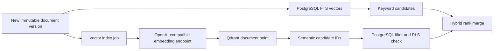

# Hybrid search

## Decision

CivicOS uses hybrid retrieval: PostgreSQL is the source of truth for keyword search, filters, and final authorization; Qdrant supplies semantic candidate recall. Qdrant is a rebuildable projection, never the authority for document visibility or metadata.

## Indexing flow

`civic.vector_index_jobs` is a durable outbox. A trigger enqueues every new document version, and document metadata or topic changes requeue the latest version so Qdrant filter payloads remain current. The ingestion worker leases jobs, creates the configured Qdrant collection on first use, upserts one current point per logical document, and retries failed embeddings or Qdrant writes with capped exponential backoff. A newer version replaces the document’s Qdrant point while PostgreSQL preserves all version history.

## API

`GET /v1/search` accepts:

- `query` — two to 500 characters.
- `mode` — `keyword`, `semantic`, or `hybrid` (default).
- `start_date`, `end_date` — inclusive publication-date bounds.
- repeated `department_id`, `topic_id`, and `source_id` filters.
- `limit` — bounded by `CIVICOS_SEARCH_MAX_LIMIT`.

The caller must provide `X-CivicOS-Organization-ID`; production authentication must derive this scope from the authenticated principal before the request reaches search. The repository sets the matching PostgreSQL RLS setting for every query. Qdrant receives the same tenant/filter payload constraints, and PostgreSQL rechecks all semantic candidates before they are returned.

Hybrid mode combines PostgreSQL and Qdrant rankings with reciprocal-rank fusion. If embeddings are not configured, hybrid mode returns keyword results with `semantic_available: false`; explicit semantic mode returns an unavailable error. This preserves useful keyword search during vector maintenance without presenting stale or unfiltered semantic results.

## Configuration

| Variable | Purpose |
|---|---|
| `DATABASE_URL` | PostgreSQL source-of-truth connection. |
| `QDRANT_URL`, `QDRANT_COLLECTION`, `QDRANT_API_KEY` | Qdrant projection connection and collection. |
| `EMBEDDING_BASE_URL`, `EMBEDDING_MODEL`, `EMBEDDING_API_KEY` | OpenAI-compatible `/embeddings` endpoint. |
| `CIVICOS_EMBEDDING_MAX_CHARACTERS` | Maximum document text sent to one embedding request. |
| `CIVICOS_SEARCH_MAX_LIMIT` | Maximum API result count. |

No embedding endpoint is enabled by default. Configure an approved local Ollama/vLLM or other OpenAI-compatible provider before semantic indexing. The endpoint, model, and credentials are service-only configuration; they must never be exposed as `NEXT_PUBLIC_*` values.
