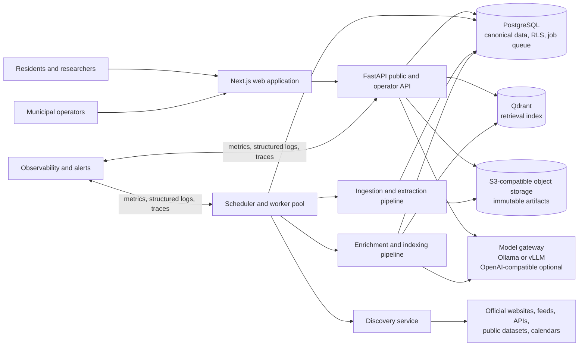
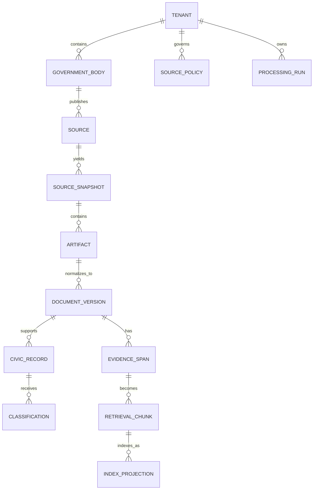
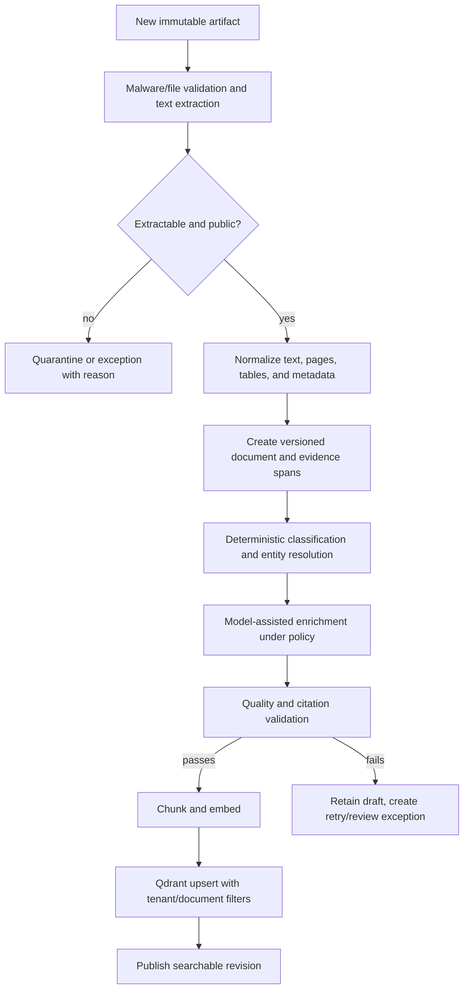
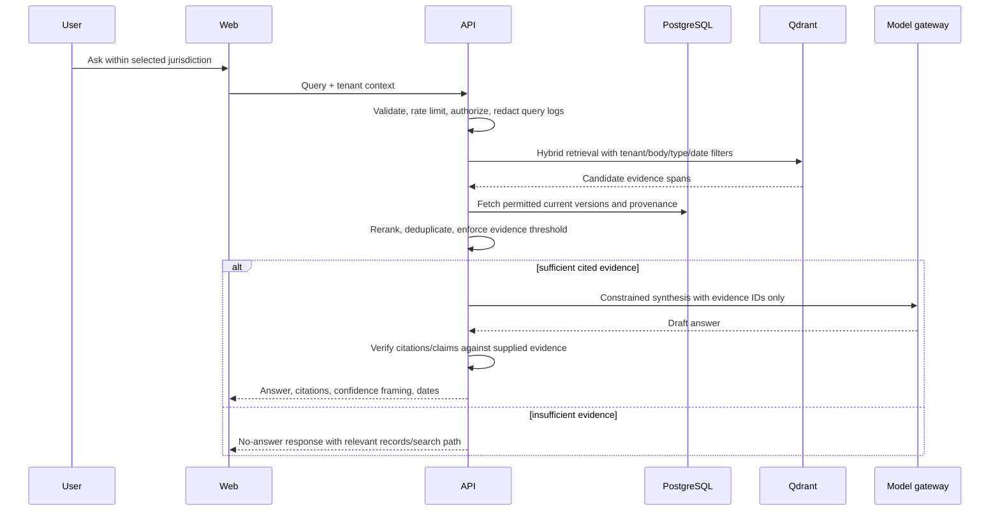

# CivicOS Architecture

**Status:** Proposed architecture — implementation has not begun  
**First jurisdiction:** St. Joseph County, Indiana  
**Scope:** A self-operating, open-source civic intelligence platform that can add counties, cities, towns, and special districts without changing application code.

## 1. Executive design

CivicOS is a multi-tenant, evidence-first system that turns public civic information into searchable, attributable records and answers. Its control plane continuously discovers official sources within each jurisdiction's approved domain boundary; its data plane retrieves, versions, extracts, classifies, and indexes source material. The public application only answers from retrieved evidence and always links back to the original record.

The design deliberately separates **raw evidence**, **canonical civic records**, and **AI-derived enrichments**. This makes updates reproducible, lets CivicOS correct a bad model result without losing the original material, and keeps a local-model default viable. PostgreSQL is the system of record; object storage holds immutable source artifacts; Qdrant is a rebuildable retrieval index.

The production baseline is a small, composable Docker deployment with independently scalable web, API, and worker processes. Reliable automation comes from a durable PostgreSQL work queue and idempotent jobs—not in-process background tasks or a dependency-heavy workflow engine.

### Goals

- Automatically discover, ingest, update, classify, and index official civic information.
- Support one logical tenant per government jurisdiction and scopes for sub-jurisdictions.
- Give residents concise, source-cited answers and chronological civic context.
- Be operable by a small municipal team after initial setup, with bounded automation and clear exception queues.
- Remain portable across self-hosted and managed infrastructure.

### Explicit non-goals for the first release

- Replacing official record systems or publishing legally authoritative records.
- Making decisions, filing requests, or communicating as a government entity.
- Inferring unverified facts, personal data, or policy outcomes.
- Fully autonomous collection beyond an approved jurisdiction/domain policy.

## 2. Architecture principles and constraints

1. **Evidence is immutable; derivations are replaceable.** Every claim, chunk, classification, entity, and embedding records its source version, model/prompt version, and processing run.
2. **Tenant isolation is enforced at the data boundary.** Every tenant-owned table has `tenant_id`; PostgreSQL row-level security (RLS) is the default protection, not merely an application convention.
3. **Configuration, not code, defines a municipality.** Source domains, government bodies, geography, polling cadences, document types, and model policies live in versioned database configuration.
4. **Automation is bounded and observable.** Discovery can crawl only approved domains and sitemaps. New sources are auto-enabled only when policy and confidence permit; all other candidates enter an exception queue.
5. **Answers are retrieval-grounded.** The answer service must attach evidence spans from an accessible public source. If evidence is insufficient, it returns a transparent limitation instead of an answer.
6. **Local-first AI, provider-agnostic.** Ollama or vLLM is the default inference target. The same adapter supports a configured OpenAI-compatible endpoint, with per-tenant egress policy and audit records.
7. **Small durable core.** PostgreSQL provides transactions, schedules, the work queue, audit log, and metadata. No Redis, Celery, Kafka, or Kubernetes is required for the initial production footprint.
8. **Public by design, privacy by default.** CivicOS collects public sources, but applies data classification, redaction rules, and restrictive access paths before exposing extracted content or sending it to an external model.

## 3. Logical system architecture



### Deployment topology

| Service | Runtime responsibility | Initial replica policy | Scale trigger |
|---|---|---:|---|
| `web` | Next.js SSR/UI; no civic-data writes | 2 | request latency / availability |
| `api` | FastAPI REST/JSON API, query orchestration, authorization | 2 | request latency / query volume |
| `worker` | scheduled acquisition, processing, enrichment, index work | 1–N | queue depth / job age |
| `postgres` | source of truth, RLS, queue, audit trail | managed HA or primary + tested backup | storage / connections |
| `qdrant` | tenant-filtered vector retrieval; rebuildable projection | 1 | vector count / query latency |
| `object-store` | versioned raw files and normalized artifacts | versioned bucket | storage / retention |
| `model` | Ollama for small local installs or vLLM for GPU serving | 1–N | token throughput |
| `observability` | OpenTelemetry collector, metrics/logs, alert routing | 1 | operational need |

Docker Compose is the supported first production topology; every service receives configuration through environment variables and mounted secret files. The same images must be deployable later on a managed container platform without changing the application architecture. PostgreSQL and object-storage backups are mandatory before a production launch.

## 4. Tenancy, jurisdiction, and configuration

The platform tenant is a **jurisdiction**, not an organization account. St. Joseph County is the initial tenant. Its county government, municipalities, boards, agencies, and special districts are represented as government bodies within that tenant. A future installation may choose a state, county, city, or regional consortium as the tenant depending on its data-governance boundary.



### Configuration hierarchy

1. **Platform defaults:** source adapters, data-retention classes, model capability requirements, global security limits.
2. **Tenant policy:** official domains, allow/deny paths, source types, public-data policy, data residency, model egress rule, languages, geographic boundary, alert recipients.
3. **Government body:** name, aliases, jurisdiction relationship, meeting calendar, ownership, source associations.
4. **Source:** canonical URL/API/feed, acquisition adapter, polling/event policy, expected formats, licensing/terms notes, parser selection, health thresholds.

All configuration changes are audited, versioned, validated before activation, and may be rolled back. Values such as county name, domains, polling schedules, model names, retention, or source parsers are never hardcoded into services.

## 5. End-to-end data flows

### A. Discovery, acquisition, and change detection

```mermaid
sequenceDiagram
  participant S as Scheduler
  participant W as Worker
  participant R as Source registry
  participant X as Official source
  participant O as Object storage
  participant P as PostgreSQL
  participant Q as Exception queue

  S->>P: Lease due, idempotent acquisition job
  P-->>W: Job + tenant/source policy
  W->>R: Load allowed domain, adapter, limits
  W->>X: Fetch sitemap/feed/API/page with rate limit
  X-->>W: Metadata or artifact
  W->>W: Validate domain, size, MIME, checksum
  alt unchanged checksum or ETag
    W->>P: Record successful observation; complete job
  else new or changed
    W->>O: Store immutable original artifact
    W->>P: Create snapshot, artifact, provenance, next job
  else policy or parsing failure
    W->>P: Record failure and retry policy
    W->>Q: Escalate when threshold reached
  end
```

Discovery begins with configured official sites, their declared feeds and sitemaps, plus links discovered on those domains. A candidate must pass canonicalization, domain allowlisting, MIME/size limits, duplicate checks, and a source-policy decision before it may schedule acquisition. It does not use unrestricted web search as an autonomous source of truth.

### B. Extract, classify, and index



Processing is restartable: each stage uses an idempotency key built from the document version, pipeline version, and model/prompt version. A failed enrichment never blocks raw evidence preservation or basic keyword search. Reprocessing a source creates a new derived revision and supersedes—not overwrites—the prior revision.

### C. Resident question flow



The model never receives database credentials or tool access. It cannot browse, call external services, or issue queries. It is given a fixed schema and retrieved evidence only. The API validates that each public citation resolves to a current, tenant-matching evidence span before returning it.

## 6. Component responsibilities

| Component | Owns | Does not own |
|---|---|---|
| Next.js web | accessible notebook-style UI, rendering, client-side state, public/operator journeys | authorization decisions, direct database access, long-running work |
| FastAPI API | API contracts, tenant context, RLS session binding, query orchestration, citations, rate limits, operator workflows | crawling, direct model policy decisions, raw artifact mutation |
| Source registry | source configuration, approval state, adapter selection, acquisition policy and health | document content or index vectors |
| Scheduler | materializing due jobs and recovery of expired leases | executing jobs |
| Worker pool | safe acquisition, parsing, enrichment, indexing, retries, dead-letter routing | HTTP request handling |
| Extractor | file safety, OCR/text/table extraction, normalized representation | semantic truth or publication decision |
| Classifier/entity resolver | controlled vocabularies, deterministic labels, entity aliases, record linkage candidates | destructive merging of civic entities |
| Model gateway | provider selection, capability checks, token limits, egress policy, model audit metadata | durable civic data or user authorization |
| Retrieval service | hybrid search, recency and source diversity ranking, evidence thresholding | answer generation without evidence |
| PostgreSQL | transactional state, source/document metadata, civic records, tenant policy, queue, audit logs | opaque files or large embedding vectors |
| Object storage | immutable raw artifacts, normalized files, checksums, retention state | metadata authority |
| Qdrant | tenant-filtered embedding projections and vector search | authoritative text, permissions, or provenance |
| Observability | health metrics, structured logs, traces, alert rules, runbook links | business workflow retries |

## 7. Canonical data model

The core schema should use stable UUID primary keys, `created_at`, `updated_at`, `tenant_id`, `provenance_id`, and optimistic revision fields where applicable. Soft deletion is reserved for operator-facing configuration; immutable artifacts and audit events are never modified in place.

| Aggregate | Key records | Invariants |
|---|---|---|
| Jurisdiction | `tenant`, `government_body`, `geography`, `source_policy` | a body and source belong to exactly one tenant |
| Source/provenance | `source`, `source_snapshot`, `artifact`, `fetch_observation`, `license_note` | original URI, fetch time, checksum, HTTP metadata, and policy decision are preserved |
| Document | `document`, `document_version`, `evidence_span`, `document_relation` | versions are append-only; evidence offsets point to one immutable version |
| Civic knowledge | `civic_record`, `event`, `meeting`, `agenda_item`, `ordinance`, `contract`, `budget_line`, `entity`, `classification` | a record must have one or more evidence spans; merge candidates require a reviewable linkage rationale |
| Processing | `processing_run`, `job`, `job_attempt`, `pipeline_version`, `model_run`, `index_projection` | job claims expire safely; all derivations are reproducible from versions |
| Trust/operations | `audit_event`, `exception`, `review_decision`, `retention_hold`, `feedback` | immutable audit events; mutations state actor, reason, and correlation ID |

### Search and retrieval design

- Generate chunks from stable evidence spans; retain heading, page/section, date, body, source type, government body, and classification metadata.
- Use PostgreSQL full-text search for lexical recall and Qdrant for semantic recall. Merge with reciprocal-rank fusion, then rerank a small candidate set with a local model only if configured.
- Filter before retrieval by `tenant_id`; apply authorization/publication filters again after retrieval. Qdrant payload alone is never a permission authority.
- Maintain a manifest of each document version’s chunk and embedding IDs. Reindexing writes a new projection, validates count/checksums, then atomically switches the active index revision.
- Store model, embedding model, prompt/template, parser, and taxonomy versions alongside all derived results.

## 8. Technology decisions

| Decision | Choice | Why | Consequence / mitigation |
|---|---|---|---|
| Web UI | Next.js + TypeScript + Tailwind CSS | fits the requested stack; enables accessible server rendering and a restrained design system | keep data access in FastAPI; avoid duplicating domain logic in route handlers |
| API/backend | FastAPI + Python | strong typed validation, async I/O, and mature document/AI ecosystem | publish an OpenAPI contract and generate a TypeScript client to prevent drift |
| System of record | PostgreSQL | mature transactions, JSONB, FTS, RLS, auditing, and queue leasing | use migrations, backups, PITR, and RLS integration tests |
| Durable background work | PostgreSQL jobs with `FOR UPDATE SKIP LOCKED`, leases, retries, and dead-letter state | reliable, inspectable, minimal dependency set | isolate job API so a dedicated broker can be introduced only if metrics justify it |
| Raw artifacts | S3-compatible object storage (MinIO self-hosted; managed S3-compatible service allowed) | immutable/versioned files should not live in the relational database | store only keys/checksums in PostgreSQL; test restore procedures |
| Semantic index | Qdrant | requested technology; filters and collections support tenant-scoped retrieval | treat it as a rebuildable projection from PostgreSQL/object storage |
| Inference | Ollama for local single-node; vLLM for GPU/multi-user; OpenAI-compatible gateway adapter | local-first with portable provider interface | do not select a default model in code; capability and egress policies are configuration |
| Extraction | adapter interface for HTML, PDF, feed, CSV/JSON, calendar, and GIS; OCR as an isolated optional worker | civic sources vary considerably and fail differently | each adapter emits a normalized artifact contract and contract tests |
| Authentication | OIDC for operators; anonymous public read/query access initially | avoids storing passwords; supports municipal SSO later | authorization roles are application-owned and enforced with PostgreSQL RLS |
| Observability | OpenTelemetry, Prometheus-compatible metrics, structured JSON logs, alert routing | portable operational visibility | no raw document text, access tokens, or sensitive prompts in logs |
| Deployment | Docker images + Compose baseline, immutable releases, CI-built SBOM | smallest production-capable initial footprint | document an explicit migration path, but do not adopt an orchestrator prematurely |

The choice of Indiana Gateway is intentionally an initial source adapter target rather than a data dependency: it is a state public-data portal for local-government financial reporting, with public access after collection. This makes it a valuable St. Joseph County source category alongside county and municipal official sites. [Indiana Gateway overview](https://www.in.gov/dlgf/gateway/overview/)  
The source registry should also cover Indiana Transparency Portal / data-hub material where it satisfies the jurisdiction policy; the state describes it as providing financial transparency data and downloadable data in some areas. [Indiana Transparency Portal](https://www.in.gov/mph/projects/indiana-transparency-portal/)

## 9. Security, privacy, and reliability baseline

### Security controls

- TLS at every ingress; encrypted storage and database backups; secrets supplied by a secret manager or mounted secret files, never committed or logged.
- OIDC authorization-code flow with PKCE for operators; short-lived sessions; roles such as `tenant_admin`, `source_editor`, `reviewer`, and `auditor`.
- Database RLS enabled on every tenant-owned table. API connections set a validated tenant context; workers use narrowly scoped service roles.
- SSRF-resistant fetcher: HTTPS by default, DNS/IP allow/deny controls, redirect revalidation, hostname allowlists, connection/time/size limits, content-type checks, and download malware scanning.
- Parse documents in constrained worker containers. Quarantine archives, executables, encrypted files, and malformed files; never render source HTML unsanitized.
- Strict CSP, output encoding, CSRF protections for operator mutations, validated input schemas, rate limits, request size caps, and audit logs for privileged actions.
- Model egress policy defaults to `local_only`. External OpenAI-compatible providers require an explicit tenant policy, approved data class, and a logged provider/model decision.

### Data governance

Every source and document receives a classification: `public`, `public_with_personal_data`, `restricted`, `unknown`, or `quarantined`. Public answers may draw only from `public` content and approved portions of `public_with_personal_data` after redaction. Retention schedules, legal holds, takedown handling, and source terms are policy records—not code paths.

### Reliability controls

- At-least-once jobs with idempotency keys and transactional outbox-style state transitions.
- Exponential backoff with jitter; per-source circuit breakers; dead-letter exceptions with actionable reason and owner.
- Artifact checksum/ETag and canonical URL comparison prevent duplicate work.
- Health SLOs: ingestion freshness by source class, failed-job age, source coverage, index lag, citation-validation rate, API availability, backup success, and restore-test age.
- Alert only on actionable conditions; daily digest for recoverable source changes and immediate alert for backup, security, or sustained pipeline failures.

## 10. Operating model for minimal founder involvement

Autonomy is achieved through reliable defaults, not by eliminating humans. A municipal operator manages exceptions, source policy, and data-governance decisions in an operator console; routine discovery, polling, reprocessing, and indexing require no founder action.

| Situation | Automatic behavior | Human involvement |
|---|---|---|
| Existing source changes | ingest new version; derive and index; record lineage | none unless quality checks fail |
| New same-domain candidate | evaluate policy and confidence; auto-enable only if policy allows | review only low-confidence or policy-blocked candidates |
| Parser/model regression | preserve raw artifact; stop publishing affected derivation; retry pinned prior pipeline if safe | reviewer resolves exception or approves changed parser/model |
| External model outage | fall back to configured local model or citation-only search | alert only if no configured fallback |
| Qdrant loss/corruption | rebuild index from manifests and immutable documents | none, except capacity incident |
| Source outage | back off and track stale status visibly | operator only after escalation threshold |
| Sensitive material detected | quarantine from public retrieval; preserve restricted audit record | reviewer applies policy decision |

The first implementation should include an operator runbook for source failure, stale data, reindexing, model-provider failure, key rotation, backup restoration, and public-record correction requests. These runbooks are release artifacts, not informal knowledge.

## 11. St. Joseph County implementation profile

The county profile must be delivered as configuration and adapter tests, not conditional application code. The initial source inventory should be verified with county stakeholders before activation and organized by source class:

| Priority | Source class | Example target | Acquisition method | Freshness objective |
|---:|---|---|---|---|
| P0 | County/board meetings | agendas, packets, minutes, videos, calendars | feed/API when available; otherwise sitemap/page extraction | daily + pre-meeting checks |
| P0 | County notices and public records | notices, ordinances, resolutions, procurement | official page/feed/document catalog | daily |
| P0 | Finance | Indiana Gateway financial reports, county financial notices | public portal adapter / downloadable records | weekly or source cadence |
| P1 | Municipal bodies in county | city/town councils, boards, commissions | per-body source configuration | daily |
| P1 | Planning and land use | plans, zoning, permits/public notices, GIS data | catalog/API/files | daily to weekly |
| P2 | State context | state legislation, agency notices, transparency data | official API/feed/catalog | source cadence |

Before go-live, CivicOS needs a written source-policy decision for every St. Joseph County domain and partner system: official status, terms/licence, desired source types, traffic limit, expected formats, PII risk, ownership, and fallback contact. This avoids silently treating an unofficial mirror as authoritative.

## 12. Development roadmap

Each stage should be a sequence of small, independently deployable pull requests. A stage exits only when its acceptance criteria, documentation, and operational tests pass.

| Stage | Outcome | Key deliverables | Exit criteria |
|---|---|---|---|
| 0. Architecture ratification | shared technical and governance baseline | ADRs, threat model, data classification policy, source-policy template, UX content principles | sponsor approves tenant boundary, hosting, source-policy authority, and model egress default |
| 1. Platform foundation | repeatable, secure local/CI environment | monorepo conventions, Docker Compose, migrations, secret/config contract, health endpoints, OpenTelemetry, CI checks, backup/restore script | fresh deploy + database restore exercised; no tenant table without RLS test |
| 2. Provenance-first ingestion | preserve and version official sources | source registry, scheduler/queue, fetcher hardening, object store, snapshots, source health UI/API | one configured source can be repeatedly fetched without duplicate artifacts; failure/retry audit visible |
| 3. St. Joseph P0 connectors | useful official local corpus | source adapters and contract fixtures for approved P0 sources, PDF/HTML extraction, document versions/evidence spans | source coverage/freshness targets met for agreed P0 inventory; artifacts trace to public originals |
| 4. Civic normalization | structured, navigable public records | taxonomy, government bodies, records/events/meetings, deterministic classifiers, public search API | every public civic record has provenance; taxonomy and entity changes are versioned |
| 5. Retrieval and cited answers | trustworthy resident experience | hybrid search, Qdrant projection, model gateway, answer validator, notebook-style Next.js UI | evaluation set meets agreed citation correctness/no-answer thresholds; every answer exposes evidence |
| 6. Autonomous operations | minimal ongoing intervention | discovery policy engine, exception console, alerts, runbooks, scheduled reindex, fallback model paths | simulated source/model/index failures recover per runbook; routine week requires no founder action |
| 7. Multi-municipality expansion | repeatable jurisdiction onboarding | tenant provisioning, configuration import/export, connector SDK, data isolation load tests, onboarding guide | second jurisdiction added without application-code changes and without cross-tenant retrieval leakage |
| 8. Hardening and public release | maintainable open-source product | security review, accessibility audit, SBOM, license/CONTRIBUTING, release process, performance/cost baselines | independent deployer can install, operate, upgrade, and restore using published docs |

### Required quality gates

- Unit tests for domain logic and source adapters; contract fixtures for every source format; integration tests with PostgreSQL/Qdrant/object storage.
- End-to-end tests for tenant isolation, public citation resolution, authorization, document versioning, idempotent jobs, and reindex recovery.
- Security checks in CI: dependency vulnerability scan, secret scan, static analysis, container image scan, migration/RLS test suite.
- Golden evaluation corpus for St. Joseph County: question → expected evidence/no-answer behavior. Track citation precision, supported-claim rate, hallucination rate, freshness, and unanswered-query rate.
- Accessibility baseline: keyboard navigation, semantic structure, contrast, responsive layout, and no color-only meaning.

## 13. Major decisions requiring approval before implementation

1. **Hosting and data residency:** self-hosted county infrastructure, a managed U.S. cloud account, or a hybrid model.
2. **Model egress policy:** local-only by default versus permitting an external OpenAI-compatible provider for approved public data classes.
3. **Initial authority boundary:** whether CivicOS covers county government only, or also every municipal government and special district within St. Joseph County at launch.
4. **Source-policy authority:** named role/team empowered to approve source domains, data classification exceptions, and automatic discovery thresholds.
5. **Public data handling:** specific redaction and takedown process for documents that are public but contain personal information.
6. **Operator identity provider:** the OIDC provider that will serve municipal operators, or an interim hosted identity arrangement.

## 14. Architecture decision record index

| ADR | Decision | Status |
|---|---|---|
| ADR-001 | Multi-tenant jurisdiction model with PostgreSQL RLS | Proposed |
| ADR-002 | PostgreSQL durable queue over external broker for initial release | Proposed |
| ADR-003 | PostgreSQL/object storage/Qdrant separation of authority | Proposed |
| ADR-004 | Local-first, OpenAI-compatible model gateway | Proposed |
| ADR-005 | Bounded official-domain discovery and provenance-first ingestion | Proposed |
| ADR-006 | Evidence-required public answers with no-answer fallback | Proposed |
| ADR-007 | Docker Compose as production baseline; portable container images | Proposed |
| ADR-008 | OIDC operators and anonymous public read access initially | Proposed |

## 15. Open assumptions to validate

- Official St. Joseph County and municipal sources expose a mix of web pages, PDFs, downloadable datasets, feeds, calendars, and possibly third-party meeting portals. Each adapter must be approved after source-inventory verification.
- The project may operate a local GPU host for vLLM only when expected traffic and model quality justify it; Ollama is suitable for smaller/local deployments.
- Financial and transparency sources can be ingested only through their publicly permitted access paths and under documented terms/rate limits. Indiana Gateway is a public-access source for local-government financial reporting. [DLGF Gateway overview](https://www.in.gov/dlgf/gateway/overview/)
- CivicOS will identify itself in its user agent and expose a contact path for source owners, with polite rate limiting and opt-out/disable capability.
